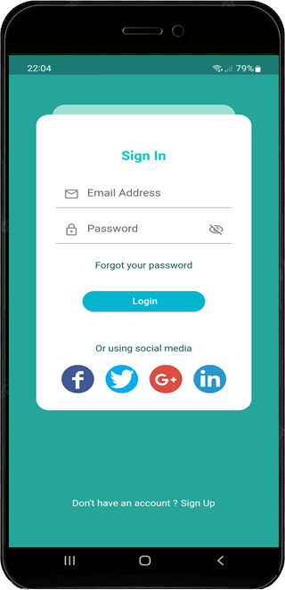

# E-Commerce App - Flutter UI 

Aplicación de comercio electrónico que puede ejecutar dispositivos Android e iOS porque se construye con flutter.

## ScreenShots 
### Home Page

En la primera parte de mi aplicación de comercio electrónico

### Sign Up Page

Acá puede registrarse como usuario de la app para posteriormente ingresar a la misma

### Sign In Page
Coloca su usuario y contraseña para ingresar, en caso de olvidar su contraseña puede recuperarla haciendo click en forgot your password

### Menu Lateral

### Home Page Categoria

Se muestran todos los articulos por categoria donde debe seleccionar la de su preferencia y posteriormente debe hacer click en el producto que desea adquirir. Por otra parte tambien se muestran los productos que estan en oferta especial.

&nbsp;&nbsp;&nbsp;&nbsp;&nbsp;&nbsp;&nbsp;&nbsp;

### Detalle del Producto Page

Se muestra toda la información detallada del producto seleccionado, en la parte inferior hace click en el signo (+) o (-) según sea el caso. Una vez ya seleccionado los productos que desea adquirir, asi como también las cantidades correspondiente debe hacer clic en el icono del carrito ubicado en la parte superior derecha.

&nbsp;&nbsp;&nbsp;&nbsp;&nbsp;&nbsp;&nbsp;&nbsp;

### Cart Page

Se muestra el listado de producto seleccionado e caso de querer eliminar o incrementar la cantidad hacer click en opcion correspondiente (-)(+). En caso de estar conforme con los productos confirmar el monto haciendo click en checkout 

### Checkout Page

Debe seleccionar metodo de pago que sea, una vez seleccionado presionar conformar.

### Fin de compra

